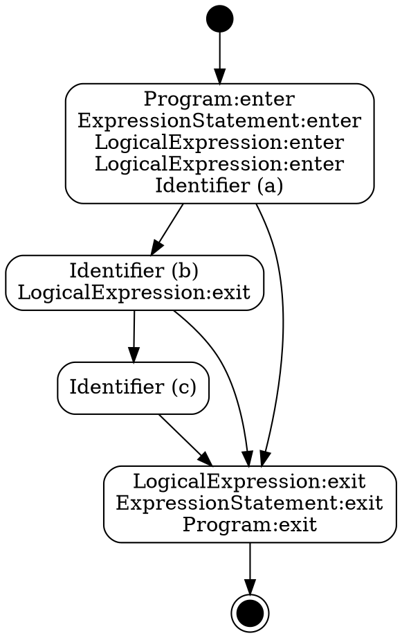

Code path analysis for (a && b) ?? c


**Tell us about your environment**


* **ESLint Version:** v7.7.0
* **Node Version:** v12.14.0
* **npm Version:** 6.13.4

**What parser (default, `@babel/eslint-parser`, `@typescript-eslint/parser`, etc.) are you using?**

default

**Please show your full configuration:**

<details>
<summary>Configuration</summary>


```js
module.exports = {
  parserOptions: {
    ecmaVersion: 2020
  }
};
```

</details>

**What did you do? Please include the actual source code causing the issue, as well as the command that you used to run ESLint.**


```js
(a && b) ?? c;
```

The rest of the bug report template isn't quite suitable for this issue.

Code path analysis gives the following:

<details>
<summary>DOT</summary>


</details>

<details>
<summary>Image</summary>


</details>

This would be correct for `(a || b) ?? c`, but I think it isn't entirely correct for `(a && b) ?? c` since there should be a path from `a` to `c` that doesn't go through `b`:

```js
(null && console.log("b")) ?? console.log("c"); // logs only "c"
```


Code path analysis for (a && b) ?? c


**Tell us about your environment**


* **ESLint Version:** v7.7.0
* **Node Version:** v12.14.0
* **npm Version:** 6.13.4

**What parser (default, `@babel/eslint-parser`, `@typescript-eslint/parser`, etc.) are you using?**

default

**Please show your full configuration:**

<details>
<summary>Configuration</summary>


```js
module.exports = {
  parserOptions: {
    ecmaVersion: 2020
  }
};
```

</details>

**What did you do? Please include the actual source code causing the issue, as well as the command that you used to run ESLint.**


```js
(a && b) ?? c;
```

The rest of the bug report template isn't quite suitable for this issue.

Code path analysis gives the following:

<details>
<summary>DOT</summary>


</details>

<details>
<summary>Image</summary>


</details>

This would be correct for `(a || b) ?? c`, but I think it isn't entirely correct for `(a && b) ?? c` since there should be a path from `a` to `c` that doesn't go through `b`:

```js
(null && console.log("b")) ?? console.log("c"); // logs only "c"
```


